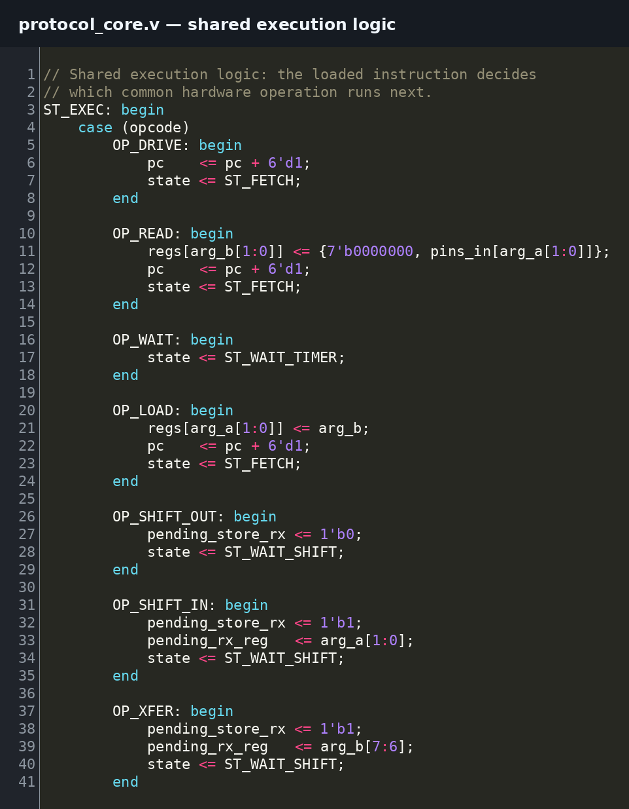
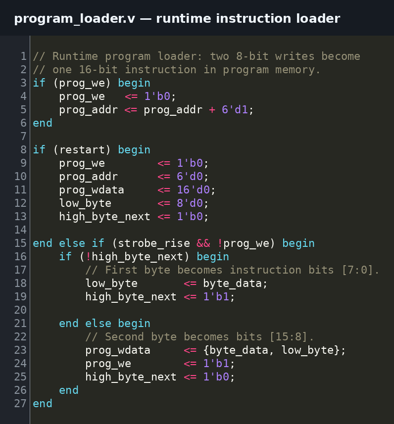

# Runtime-Programmable Multi-Protocol Emulator

A reprogrammable communication engine supporting **UART, SPI, I2C, JTAG, PS/2 and SWD on one shared hardware core**.

Instead of building and maintaining a separate controller for every protocol, we built the common timing, bit-transfer and pin-control hardware once. The protocol itself is stored as a small program in writable memory, so the same hardware can be reused for different interfaces and different test sequences.

The design was developed on a **DE10-Lite FPGA**, verified in simulation and on hardware, then adapted for **Tiny Tapeout / IHP CMOS5L** and taken through gate-level verification, physical design and GDS generation.

**6 protocols · 557 LEs · ~27% less logic than the 6-protocol hard-coded version · +9.537 ns setup slack at 50 MHz · 6/6 gate-level tests passed**

---

## What We Built

The supported protocols are different, but they repeatedly need the same basic actions: drive or read a signal, wait for timing, shift bits, generate clocks, store received data and react to a response.

We turned those common actions into one shared core. A **64 × 16-bit writable program memory** tells the core which action to perform next.

- UART can load a program that sends a start bit, data and a stop bit.
- SPI can use the same core to control a clock, device-select line and serial data.
- I2C can send an address, release the data line, read the connected device's response and choose what to do next.

Changing the program changes the communication behavior without replacing the hardware architecture.

  

<em>Quartus post-synthesis view of the shared protocol core.</em>

The RTL below is the shared execution logic. The loaded instruction decides whether the same core should read a pin, wait, move bits or perform another communication operation.

  

<em>Shared execution logic used by the protocol programs.</em>

### Why reprogrammability matters

During board bring-up or debugging, the interface often stays the same while the transaction changes. An engineer may need to try another device address, slow the timing, send different data or check a different response.

With a fixed controller, that can require editing RTL and rebuilding the FPGA image. With this design, those changes can be made in the loaded program while the underlying hardware stays the same.

That makes one core useful across multiple boards and devices and reduces the number of separate protocol implementations that need to be maintained.

---

## Hard-Coded vs Programmable

This became the main architecture comparison in the project.

A conventional multi-protocol design can place UART, SPI, I2C, JTAG, PS/2 and SWD controllers side by side. That is simple, but every controller brings its own state machine, timing logic, registers, serial-transfer logic and pin-control logic.

Some of those jobs are duplicated even though only one protocol may be active at a time.

The programmable version pays an upfront cost for program memory and instruction execution, but it reuses the same timer, shifter, registers and I/O control across the protocols.

### Measured FPGA results

| Supported protocols | Hard-coded design | Programmable design |
|---:|---:|---:|
| 3 | **347 LEs** | **557 LEs** |
| 4 | **475 LEs** | **557 LEs** |
| 5 | **572 LEs** | **557 LEs** |
| 6 | **762 LEs** | **557 LEs** |

The result was not that programmability is always smaller.

With three or four protocols, the fixed controllers use less logic because the programmable core still carries the cost of program storage and execution. Around **five protocols**, the two approaches reach roughly the same size.

At six protocols:

**762 LEs → 557 LEs**

That is **205 fewer logic elements, or about a 27% reduction**.

  

<em>Quartus resource report for the 557-LE programmable implementation.</em>

### Why the hard-coded design grows faster

Adding another fixed protocol can add another controller with its own timing, shifting, registers and control path. The top level also needs more logic to decide which controller owns the external pins.

The programmable version moves more of that protocol-specific behavior into memory. Once the shared hardware exists, adding another supported protocol is closer to adding another program than adding another complete controller.

### Why the extra logic matters

An FPGA has a fixed amount of hardware. If the communication block uses **762 LEs instead of 557**, those extra 205 LEs are no longer available for the rest of the system.

That can matter when the protocol engine sits beside sensor processing, graphics, memory interfaces, control logic or another accelerator. More duplicated logic also gives the FPGA tools more hardware and routing to place and connect.

We did **not** measure a separate power or routing-congestion improvement, so those are not claimed as project results. The measured result is the logic reduction itself.

The shared design also still met timing with **+9.537 ns setup slack at 50 MHz**.

For a small fixed set of interfaces, dedicated controllers can still be the better choice. In our builds, the programmable architecture became competitive at about **five protocols** and clearly smaller at six.

---

## Key Results

| Metric | Result |
|---|---:|
| Supported protocols | **6** |
| Programmable implementation | **557 LEs** |
| 6-protocol hard-coded implementation | **762 LEs** |
| Logic saved | **205 LEs / ~27%** |
| Registers | **165** |
| Program memory | **64 × 16 = 1,024 bits** |
| FPGA clock | **50 MHz** |
| Setup slack | **+9.537 ns** |
| Gate-level protocol tests | **6 / 6 passed** |
| Final routing DRC errors | **0** |
| LVS / antenna checks | **Passed** |
| ASIC output | **GDS generated** |

---

## Verification

We used **Icarus Verilog** to run the RTL testbenches and **GTKWave** to inspect the actual protocol signals. A test was not considered correct just because the program reached its final instruction; the transmitted bits, clocks and external responses also had to match the expected transaction.

| Protocol | What was checked |
|---|---|
| **UART** | Start bit, 8 data bits and stop bit |
| **SPI** | 8 clock edges, transmitted byte and device-select behavior |
| **I2C** | Start, address transfer, device response and success/failure path |
| **PS/2** | Start, 8 data bits, parity and stop bit |
| **SWD** | Request, turnaround, 3-bit device response and 32-bit data transfer |
| **JTAG** | Expected state movement and data-register scan |

### PS/2 waveform

The PS/2 test sends one complete device-to-host frame. The data line carries a start bit, eight data bits, odd parity and a stop bit while the clock advances the frame. The waveform lets us check the bit order and clocked transfer directly instead of only trusting the final program state.

  

<em>PS/2 frame validation in GTKWave.</em>

### SWD waveform

The SWD test first sends a write request, then releases the shared data line so the other side can respond. The core samples the 3-bit response before taking control of the line again and sending a 32-bit payload plus parity.

This checks both the data being transferred and the point where control of the shared wire changes sides.

  

<em>SWD request, response window and data transfer in GTKWave.</em>

The same RTL was then synthesized in **Quartus Prime** and run on the **DE10-Lite**. The seven-segment displays exposed the selected protocol, execution status and sent/received values, which helped separate an internal RTL problem from an external wiring or device-response problem.

---

## FPGA to ASIC

After the FPGA version was working, we kept the same core and changed the parts that depended on FPGA-specific hardware.

The main changes were:

- split bidirectional pins into separate input, output and output-enable signals
- removed the Intel-specific memory setting
- adapted the reset for the Tiny Tapeout interface
- replaced the wide FPGA programming connection with an **8-bit sequential program loader**

The loader receives two 8-bit values, combines them into one 16-bit instruction and writes it into program memory. This keeps the ASIC **reprogrammable after fabrication** instead of fixing one protocol into the silicon.

  

<em>Runtime program loader used by the ASIC version.</em>

### ASIC verification and physical design

The ASIC regression reused the same six protocol programs. **Cocotb** loaded them through the runtime loader and checked the resulting pad behavior at gate level.

**6 / 6 protocol regressions passed.**

The design was then taken through synthesis, placement, routing and physical checks:

- **0 final routing DRC errors**
- **LVS passed**
- **Antenna checks passed**
- **0 setup TNS**
- **0 hold TNS**
- **Final GDS generated**

  

<em>Zoomed view of the active placed-and-routed ASIC region.</em>

The crop above focuses on the actual routed logic rather than the unused portion of the allocated floorplan. The **27% reduction** discussed earlier comes from the FPGA synthesis comparison, not from visually measuring empty space in the GDS.

---

## What We Learned

- **Shared hardware has a break-even point.** The programmable version was larger at three and four protocols, roughly even at five and smaller at six.
- **Program completion is not enough.** Correct waveforms, timing and device responses have to be checked.
- **External hardware can look like an RTL failure.** Wiring, pull-ups and missing device responses caused problems that were not faults in the core itself.
- **FPGA-to-ASIC migration changes the interface around the design.** Pin limits, memory behavior, reset handling and bidirectional I/O all needed attention even though the main architecture stayed the same.

---

## Next Steps

- Build an assembler that converts readable protocol steps into the 16-bit program format
- Build a Python tool for loading programs and changing timing/data during debugging
- Add automatic protocol detection by observing an unknown interface and testing likely communication patterns
- Perform post-silicon measurements if fabricated hardware becomes available

---

## Tools

**Verilog · Quartus Prime · Icarus Verilog · GTKWave · Cocotb · Python · DE10-Lite · Tiny Tapeout · LibreLane · IHP CMOS5L · Git/GitHub**

---

## Team

**Ali Barrak · Aadit Mital**
