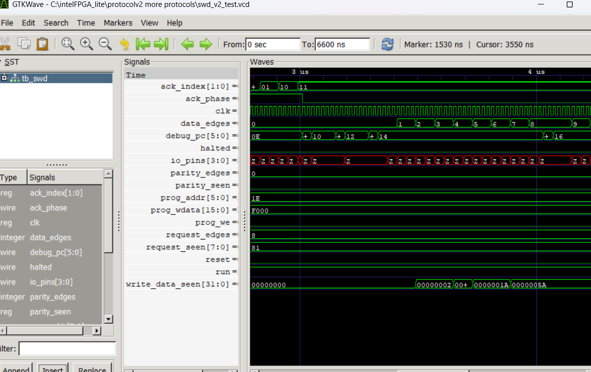
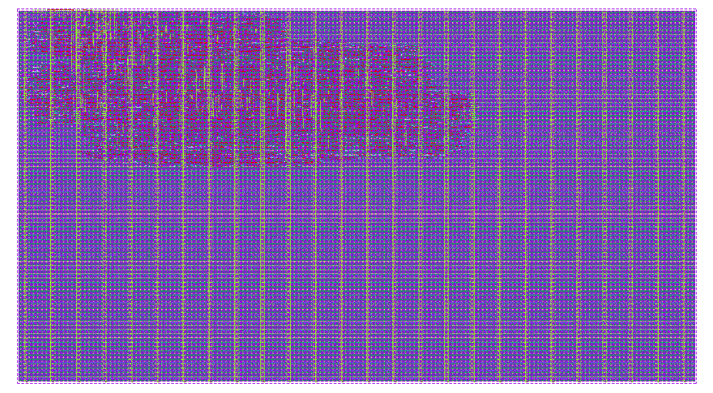

# Runtime-Programmable Multi-Protocol Emulator

A reprogrammable communication engine supporting **UART, SPI, I2C, JTAG, PS/2 and SWD on one shared hardware core**.

Instead of building a separate controller for every communication standard, we built the common timing, data-transfer and pin-control hardware once. Protocol behavior is stored in writable program memory, so loading a different program changes how the same hardware communicates.

The design was developed on a **DE10-Lite FPGA** and later adapted for ASIC implementation through **Tiny Tapeout**, including gate-level verification, physical design and GDS generation.

**Verilog · 50 MHz · DE10-Lite · Tiny Tapeout**

---

## How It Works

The six supported protocols work differently, but they repeatedly need many of the same basic operations:

- drive or read a signal
- send and receive bits
- wait for a set amount of time
- generate clock edges
- store received data
- check how another device responded
- choose what happens next

We implemented those functions once using a shared timer, data shifter, small register bank and pin-control block.

The loaded program decides how those blocks are used.

A UART program can send a start bit, eight data bits and a stop bit. SPI uses the same hardware to generate a clock and transfer data. I2C can send an address, wait for the connected device to respond and choose what to do next.

The final design uses a **64 × 16-bit writable program memory**.

  

<em>Post-synthesis view of the programmable protocol core in Quartus.</em>

The program itself is built from simple communication operations:

1. drive a pin HIGH or LOW
2. read a pin
3. wait for a set amount of time
4. wait for a signal change
5. load data
6. send several bits
7. read several bits
8. send and receive during the same transfer
9. move to another part of the program
10. make a decision from a received value
11. set timing, pins and bit order
12. finish the transaction

The hardware remains largely fixed while the program changes its behavior.

---

## Why Make It Reprogrammable?

The same hardware can be reused across different devices without building another controller every time.

If one board needs UART and another needs SPI, a different program can be loaded into the same core.

The same idea helps during debugging. If an I2C device is not responding, the program can be changed to try:

- another device address
- different timing
- different transmitted data
- a different response check
- a different sequence of operations

On the FPGA, changing RTL normally means repeating:

**edit → compile → timing check → generate bitstream → program FPGA**

If the existing hardware already supports the required operations, changing the loaded program is much faster.

It also lets one hardware platform work with several boards and devices instead of maintaining a different controller for each case.

The ASIC version keeps this capability through a runtime program loader, so the communication behavior can still be changed after fabrication.

Possible uses include electronics test equipment, robots using parts from different vendors, automotive electronics and products whose connected hardware changes between revisions.

---

# Hard-Coded vs Programmable

This became the main architecture comparison in the project.

A straightforward six-protocol design can contain six separate controllers:

- UART
- SPI
- I2C
- JTAG
- PS/2
- SWD

That works, but each controller brings its own hardware.

UART may have its own timing and data-transfer logic. SPI needs similar functions again. I2C needs many of them again.

Our design shares those common resources.

Instead of adding another complete controller when another protocol is needed, much of the new behavior becomes another program stored in memory.

## FPGA Comparison

We synthesized conventional hard-coded versions and compared them with the programmable design.

| Protocols | Hard-Coded | Programmable |
|---:|---:|---:|
| 3 | **347 LEs** | **557 LEs** |
| 4 | **475 LEs** | **557 LEs** |
| 5 | **572 LEs** | **557 LEs** |
| 6 | **762 LEs** | **557 LEs** |

The programmable approach is **not automatically smaller**.

It needs extra hardware to store and execute programs, so when only a few protocols are required, the fixed design uses less logic.

At around five protocols, the two approaches became roughly equal.

At six protocols:

**762 LEs → 557 LEs**

That saved **205 logic elements, or about 27%**.

  

<em>Quartus resource report showing 557 logic elements used by the programmable design.</em>

## Why the Hard-Coded Design Grows Faster

Adding another fixed protocol controller usually means adding more:

- timing hardware
- data-transfer hardware
- registers
- control logic
- logic for selecting which controller is active

The programmable design keeps reusing hardware that is already present.

The scaling moves closer to:

**another protocol → another program**

instead of:

**another protocol → another complete controller**

## Why Saving Logic Matters

An FPGA only has a fixed amount of hardware available.

Using **205 fewer logic elements** leaves more room for the rest of the system, such as:

- sensor processing
- graphics
- memory interfaces
- control logic
- hardware accelerators
- additional interfaces

We did not separately measure power or routing congestion, so we do not claim improvements for either.

The measured result is the reduction in logic usage.

The programmable core also achieved **+9.537 ns setup slack at 50 MHz**, so sharing the hardware still allowed the design to meet its target clock.

For a product that only needs a few fixed protocols, dedicated controllers may still make more sense.

For a system that supports many communication methods or needs to change behavior during debugging, the shared design becomes more useful.

At six protocols we achieved:

- **6 communication standards**
- **557 logic elements**
- **205 fewer LEs than the hard-coded version**
- **~27% lower logic usage**
- **runtime reprogramming**
- **positive timing slack at 50 MHz**

---

## Key Results

| Metric | Result |
|---|---:|
| Supported protocols | **6** |
| Programmable design | **557 LEs** |
| 6-protocol hard-coded design | **762 LEs** |
| Logic saved | **205 LEs / ~27%** |
| Registers | **165** |
| Program memory | **1,024 bits** |
| FPGA clock | **50 MHz** |
| Setup slack | **+9.537 ns** |
| Gate-level tests | **6 / 6 passed** |
| Final routing DRC errors | **0** |
| LVS / Antenna | **Passed** |
| ASIC output | **GDS generated** |

---

## Protocols Tested

| Protocol | Test |
|---|---|
| **UART** | Start bit, 8-bit transfer and stop bit |
| **SPI** | Mode 0 transfer, clocking and device select |
| **I2C** | Start, device address, response and stop |
| **PS/2** | Start, data, parity and stop frame |
| **SWD** | Request, device response and data transfer |
| **JTAG** | State movement and data-register scan |

---

## FPGA Verification

We first tested the RTL using **Icarus Verilog** and viewed the generated signals using **GTKWave**.

The tests checked the actual communication behavior rather than only whether the program reached its final instruction.

Checks included:

- transmitted data
- bit order
- generated clock edges
- responses from the other side
- program progress
- shared-pin behavior

### PS/2 Simulation

  

<em>PS/2 simulation showing clock activity, bit progression and program execution.</em>

### SWD Simulation

  

<em>SWD simulation showing request, response and transferred data.</em>

The same RTL was then compiled in **Quartus Prime** and tested on the **DE10-Lite FPGA**.

The board's seven-segment displays were used to show the selected protocol, execution status and sent/received values.

This helped separate failures inside the core from external problems such as incorrect wiring, a wrong device address or a connected device that did not respond.

---

## FPGA to ASIC

After the FPGA implementation worked, we adapted the same architecture for Tiny Tapeout.

The main changes were:

- adapting bidirectional pins for the ASIC interface
- removing the Intel-specific FPGA memory setting
- adapting the reset
- replacing the wide FPGA programming connection with an **8-bit program loader**

The loader receives two bytes, combines them into one 16-bit instruction and stores it in program memory.

This preserved the main feature of the project:

**the ASIC remains reprogrammable after fabrication.**

---

## ASIC Verification & Physical Design

The ASIC version reused the same six protocol programs.

**Cocotb** loaded each program through the ASIC loader and checked the resulting communication signals.

**6 / 6 gate-level protocol tests passed.**

The design was then taken through:

- synthesis
- standard-cell placement
- routing
- timing checks
- DRC
- LVS
- antenna checks
- GDS generation

Final results:

- **0 final routing DRC errors**
- **LVS passed**
- **Antenna checks passed**
- **0 setup TNS**
- **0 hold TNS**
- **Final GDS generated**

  

<em>Final placed-and-routed ASIC implementation.</em>

The physical layout represents the same programmable communication architecture originally developed and verified on the FPGA.

---

## What We Learned

**Shared hardware has a break-even point.** The programmable design was larger with only three or four protocols, about equal at five and smaller at six.

**Finishing a program does not prove the protocol worked.** The actual data, timing and external response also had to be checked.

**External hardware can look like an RTL problem.** Wiring issues or a connected device that does not respond can make a working core appear broken.

**FPGA and ASIC constraints are different.** Pin count, memory, reset and bidirectional signals all required changes during the ASIC migration.

---

## Next Steps

- Build a tool that converts readable communication steps into program memory
- Build a Python interface for changing protocol, timing and transmitted data
- Add automatic protocol detection by observing signals and testing likely device responses
- Perform post-silicon testing if fabricated hardware becomes available

---

## Tools

**Verilog · Quartus Prime · Icarus Verilog · GTKWave · Cocotb · Python · DE10-Lite · Tiny Tapeout · LibreLane · IHP CMOS5L**

---

## Team

**Ali Barrak · Aadit Mital**
